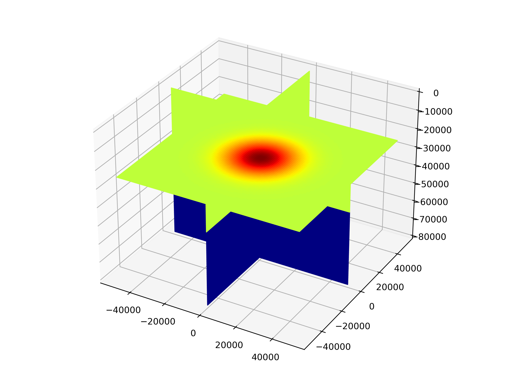
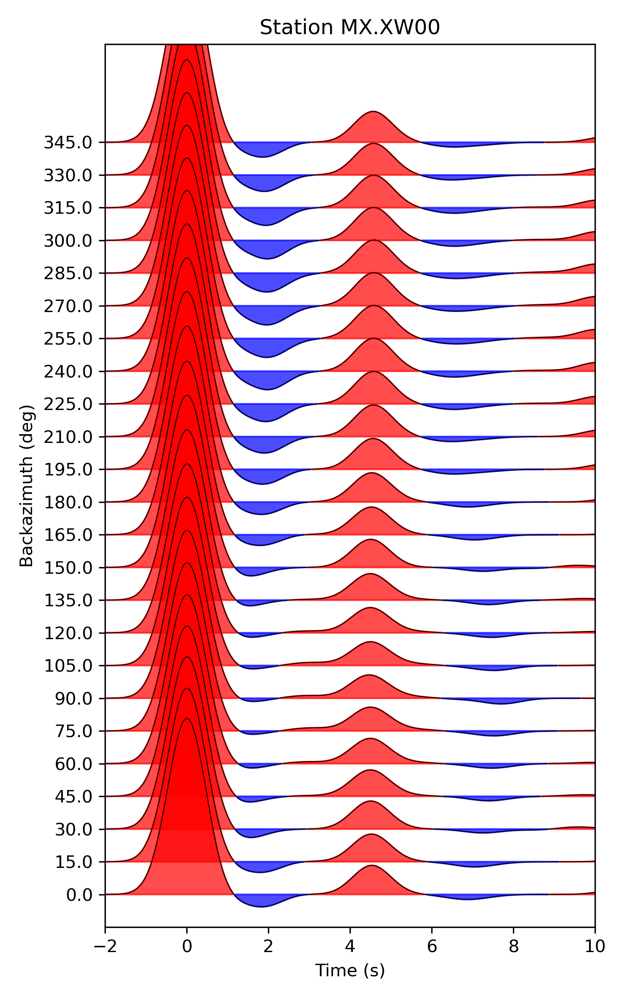
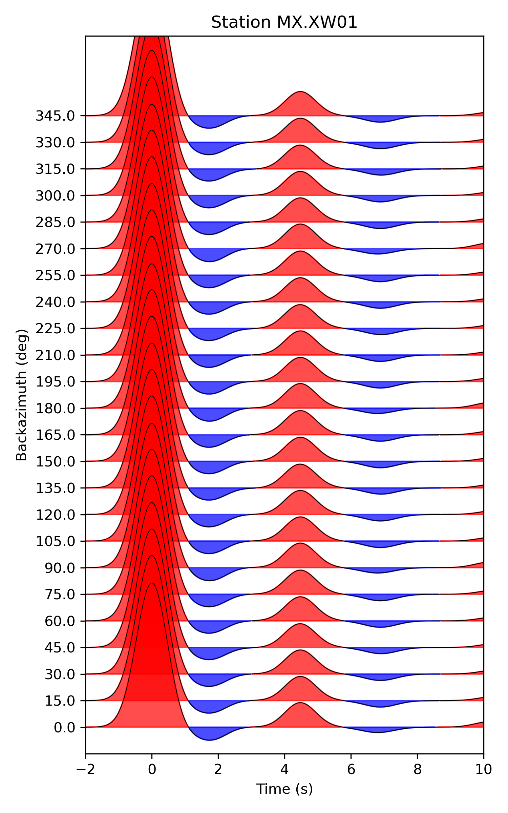

# Toy example of receiver function simulation using SEM-FK hybrid method

This repository contains a simple example of how to simulate receiver functions using a hybrid method that combines the Spectral Element Method (SEM) and the Frequency Wavenumber Method (FK) hybrid method. The example is based on a two-layer crust-mantle model and demonstrates the basic workflow for setting up the model, running the simulation, and visualizing the results.

## Requirements

- Python 3.10 or higher
  - NumPy
  - h5py
  - Matplotlib
  - ObsPy
- [SpecFWAT](https://specfwat.xumijian.me/):
  See [Installation Instructions](https://specfwat.xumijian.me/docs/installation/download) to learn how to install SpecFWAT.

## Create soft link to SpecFWAT

Create a soft link to the SpecFWAT directory in the current directory:

```bash
ln -s /path/to/SpecFWAT/bin ./
```

## Model Setup

The model consists of two layers: a crust with a thickness of 40 km and a mantle with thickness of 40 km. A -10% velocity perturbation is applied in the crust centered at a depth of 25 km with a gaussian shape.

The details of the model are defined in the `01_create_grid_model.ipynb` notebook.

## Source and Receiver Setup

Injection of a plane wave with frequency of 1 Hz (Gaussian wavelet) will be prepared in the `02_create_source_receiver.ipynb` notebook.  receivers are placed at the surface with a spacing of 10 km (See `DATA/STATIONS`).



## Generate SEM Mesh and database
The SEM mesh is generated using the `xfwat_mesh_databases` command line tool. The mesh is created with a minimum period of 1 seconds. The parameters for the mesh generation follows the documentation of [Specfem3d](https://specfem3d.readthedocs.io/en/latest/03_mesh_generation/).

## Run SEM-FK simulation
The SEM-FK simulation is run using the `xfwat_fwd_measure_adj` command line tool. The parameters are defined in `DATA/fwat_params.yml`, which follows the documentation of [SpecFWAT](https://specfwat.xumijian.me/docs/preparation/parameter).

## Visualization
The receiver function are saved in the `fwat_data/` order by sources. The raw seismograms are saved in `solver/`.

The visualization of the receiver functions is done in the `05_vis.ipynb` notebook.

The posistion of MX.XW00 is (-10000, 0, 0) and MX.XW01 is (0, 0, 0).
<table>
  <tr>
    <td></td> 
    <td></td>
  </tr>
</table>
